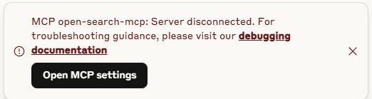

# Open Search MCP - HTTP API Usage Guide

## Overview

Open Search MCP v2.0 supports dual operation modes:
- **MCP Mode**: Model Context Protocol for AI platform integration (Claude Desktop, Augment Codes, Cursor, etc.)
- **API Mode**: HTTP REST API for direct integration with applications
- **Dual Mode**: Both MCP and API modes simultaneously

## Quick Start

### 1. Install Dependencies
```bash
npm install
```

### 2. Build the Project
```bash
npm run build
```

### 3. Start the Server

#### MCP Mode (Default)
```bash
npm run start:mcp
# or
SERVER_MODE=mcp npm start
```

#### API Mode
```bash
npm run start:api
# or
SERVER_MODE=api API_PORT=3000 API_KEYS=your-secret-key npm start
```

#### Dual Mode
```bash
npm run start:dual
# or
SERVER_MODE=dual API_PORT=3000 API_KEYS=key1,key2 npm start
```

## Environment Variables

| Variable | Description | Default | Example |
|----------|-------------|---------|---------|
| `SERVER_MODE` | Server operation mode | `mcp` | `mcp`, `api`, `dual` |
| `API_PORT` | HTTP API port | `3000` | `8080` |
| `API_HOST` | HTTP API host | `0.0.0.0` | `localhost` |
| `API_KEYS` | Comma-separated API keys | Auto-generated | `key1,key2,key3` |
| `API_ENABLE_CORS` | Enable CORS | `true` | `false` |
| `API_RATE_LIMIT_WINDOW` | Rate limit window (ms) | `900000` | `600000` |
| `API_RATE_LIMIT_MAX` | Max requests per window | `100` | `200` |

## HTTP API Endpoints

### Authentication
All API endpoints require authentication via the `X-API-Key` header:
```bash
curl -H "X-API-Key: your-secret-key" http://localhost:3000/api/info
```

### Core Endpoints

#### 1. Server Information
```bash
GET /api/info
```
Returns server information and available endpoints.

#### 2. List Available Tools
```bash
GET /api/tools
```
Returns all available search tools with descriptions.

#### 3. Execute Tool
```bash
POST /api/tools/{toolName}
Content-Type: application/json

{
  "query": "machine learning",
  "maxResults": 10
}
```

### Specialized Search Endpoints

#### Web Search
```bash
POST /api/search/web
Content-Type: application/json

{
  "query": "artificial intelligence trends 2024",
  "maxResults": 20,
  "includeSnippets": true
}
```

#### Academic Search
```bash
POST /api/search/academic
Content-Type: application/json

{
  "query": "neural networks deep learning",
  "sources": ["arxiv", "pubmed", "ieee"],
  "dateRange": {
    "start": "2023-01-01",
    "end": "2024-12-31"
  }
}
```

#### News Search
```bash
POST /api/search/news
Content-Type: application/json

{
  "query": "climate change technology",
  "sources": ["techcrunch", "bbc", "reuters"],
  "maxResults": 15
}
```

#### Forums Search
```bash
POST /api/search/forums
Content-Type: application/json

{
  "query": "python programming best practices",
  "platforms": ["reddit", "stackoverflow", "quora"]
}
```

### PDF Research Endpoints

#### PDF Research
```bash
POST /api/pdf/research
Content-Type: application/json

{
  "query": "quantum computing algorithms",
  "maxDocuments": 5,
  "forceOCR": false,
  "dateRange": {
    "start": "2023-01-01",
    "end": "2024-12-31"
  }
}
```

#### PDF Analysis
```bash
POST /api/pdf/analyze
Content-Type: application/json

{
  "url": "https://arxiv.org/pdf/2301.12345.pdf",
  "forceOCR": true,
  "extractStructure": true
}
```

### OCR Debug Endpoints

#### OCR Health Check
```bash
POST /api/ocr/health
Content-Type: application/json

{
  "includeEngineDetails": true,
  "testConnectivity": true
}
```

#### OCR Debug Test
```bash
POST /api/ocr/debug
Content-Type: application/json

{
  "query": "machine learning",
  "forceOCR": true,
  "ocrEngine": "claude",
  "maxDocuments": 2
}
```

### Crawling Endpoints

#### Single URL Crawling
```bash
POST /api/crawl/url
Content-Type: application/json

{
  "url": "https://example.com/article",
  "extractText": true,
  "followLinks": false
}
```

#### Batch Crawling
```bash
POST /api/crawl/batch
Content-Type: application/json

{
  "urls": [
    "https://example1.com",
    "https://example2.com"
  ],
  "maxConcurrency": 3
}
```

## Response Format

All API responses follow this format:

### Success Response
```json
{
  "success": true,
  "data": {
    // Tool-specific response data
  },
  "metadata": {
    "tool": "web_search",
    "executedAt": "2024-01-15T10:30:00.000Z"
  }
}
```

### Error Response
```json
{
  "success": false,
  "error": "Tool execution failed",
  "message": "Rate limit exceeded for tool: web_search",
  "tool": "web_search"
}
```

## Rate Limiting

The API implements rate limiting to prevent abuse:
- Default: 100 requests per 15-minute window
- Configurable via environment variables
- Rate limits are applied per API key

## CORS Support

CORS is enabled by default for all origins. To disable:
```bash
API_ENABLE_CORS=false npm run start:api
```

## Integration Examples

### JavaScript/Node.js
```javascript
const axios = require('axios');

const client = axios.create({
  baseURL: 'http://localhost:3000/api',
  headers: {
    'X-API-Key': 'your-secret-key',
    'Content-Type': 'application/json'
  }
});

// Search for academic papers
const searchPapers = async (query) => {
  try {
    const response = await client.post('/search/academic', {
      query,
      maxResults: 10
    });
    return response.data;
  } catch (error) {
    console.error('Search failed:', error.response.data);
  }
};
```

### Python
```python
import requests

class OpenSearchClient:
    def __init__(self, api_key, base_url='http://localhost:3000/api'):
        self.session = requests.Session()
        self.session.headers.update({
            'X-API-Key': api_key,
            'Content-Type': 'application/json'
        })
        self.base_url = base_url
    
    def search_web(self, query, max_results=10):
        response = self.session.post(f'{self.base_url}/search/web', json={
            'query': query,
            'maxResults': max_results
        })
        return response.json()

# Usage
client = OpenSearchClient('your-secret-key')
results = client.search_web('artificial intelligence')
```

### cURL Examples
```bash
# Web search
curl -X POST http://localhost:3000/api/search/web \
  -H "X-API-Key: your-secret-key" \
  -H "Content-Type: application/json" \
  -d '{"query": "machine learning", "maxResults": 5}'

# PDF research with OCR
curl -X POST http://localhost:3000/api/pdf/research \
  -H "X-API-Key: your-secret-key" \
  -H "Content-Type: application/json" \
  -d '{"query": "quantum computing", "forceOCR": true, "maxDocuments": 3}'
```

## Production Deployment

### Security Considerations
1. Use strong, unique API keys
2. Enable HTTPS in production
3. Configure appropriate rate limits
4. Monitor API usage and logs

### Environment Setup
```bash
# Production environment variables
export SERVER_MODE=api
export API_PORT=8080
export API_HOST=0.0.0.0
export API_KEYS=prod-key-1,prod-key-2
export API_RATE_LIMIT_MAX=1000
export NODE_ENV=production
```

### Docker Deployment
```dockerfile
FROM node:18-alpine
WORKDIR /app
COPY package*.json ./
RUN npm ci --only=production
COPY dist ./dist
EXPOSE 3000
CMD ["npm", "run", "start:api"]
```

## Troubleshooting

### Common Issues

1. **API Key Authentication Failed**
   - Ensure `X-API-Key` header is included
   - Verify API key is in the `API_KEYS` environment variable

2. **Rate Limit Exceeded**
   - Reduce request frequency
   - Increase rate limit via environment variables

3. **OCR Not Working**
   - Check OCR health: `POST /api/ocr/health`
   - Ensure API keys are set for Claude/Gemini engines
   - Use `forceOCR: true` for testing

4. **Port Already in Use**
   - Change port: `API_PORT=8080 npm run start:api`
   - Check for other running services

For more help, check the logs or create an issue on GitHub.
